## chat-room

### 说明

本项目灵感来自交大x字节跳动的公开课，样式参考其`demo`[^1]，但本项目采用`React`[^2]所写，UI组件使用`Antd`[^3]

本项目实现的功能有：

- [x] 用户登录
- [x] 用户注册
- [x] 单人聊天
- [x] 多人聊天
- [x] 表情发送
- [x] 文件传输
- [x] 发送语音
- [x] 视频通话


本项目采用的技术有：

- [x] `React & Antd`
  - 开发前端界面
- [x] `Electron`
  - 打包应用程序，本地测试不适用于https，因为证书不被信任
- [x] `nodejs & socket.io & express`
  - 后端逻辑处理
- [x] `WebRTC`
  - 语音聊天，音视频通话
- [x] `sqlite3`
  - 数据库管理，用户注册登录

### 如何测试本项目

本项目测试所需要的条件根据不同的功能有所不同，主要是因为局域网中视频通话需要使用https，下面进行简单的说明，`不保证`按照本说明便可以正常运行该项目

简单测试，请直接运行安装包，安装该应用程序，然后进入server下运行

```bash
yarn install
yarn start
```


#### 运行于http环境

> 在该条件下，可以运行绝大多数的功能，除发送语音&视频通话
>
> <span style="color: red">也可以使用[安装包](https://github.com/junhaideng/chat-room/releases)进行安装，服务端操作同下</span>

1. 进入到客户端目录下(含`package.json`)，执行下面的操作

```bash
# 建议使用yarn
yarn install --production # 如需打包，运行yarn install
yarn start
```

这个时候，项目应该会在如下网址运行

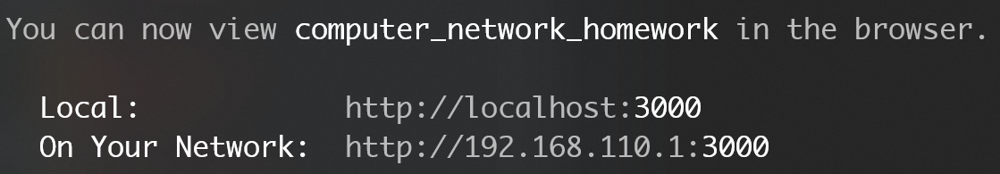

2. 直接在网页中打开，效果如下

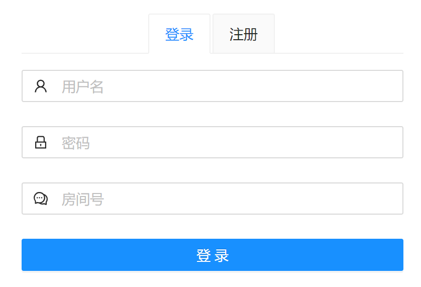

3. 执行到上面的步骤之后，需要到server目录下执行服务端代码

```bash
yarn install
yarn start
```

运行完之后，控制台会打印出对应的端口号

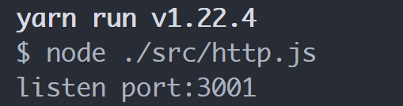

此时可以访问`http://localhost:3001`进行确认服务端是否运行正常，如果页面中出现`access success`，说明可以访问，服务端正常运行

4. 回到第2步，登录进入，如果没有账号密码，可以先注册一个，这里提供几个测试用的账号密码，为了看到效果，可以同时登录多个账号(同一房间)

   | 账号 | 密码 |
   | ---- | ---- |
   | a    | a    |
   | b    | b    |
   | c    | c    |


5. 在聊天成员中选择任意一个，便可以发送信息，对方收到对应信息，如果对方当前聊天对象不是发送对象，那么便会出现红点进行提示

   > 选中一个，才能发送消息~
   
   该条件下只能发送文件，文本信息以及表情
   
   > 在`http://localhost:3000`(非其他局域网ip地址访问网页)条件下，可以使用语音视频功能

<div style="width:100%;display:flex;flex-flow:row wrap; align-content:space-between; padding:10px"}>
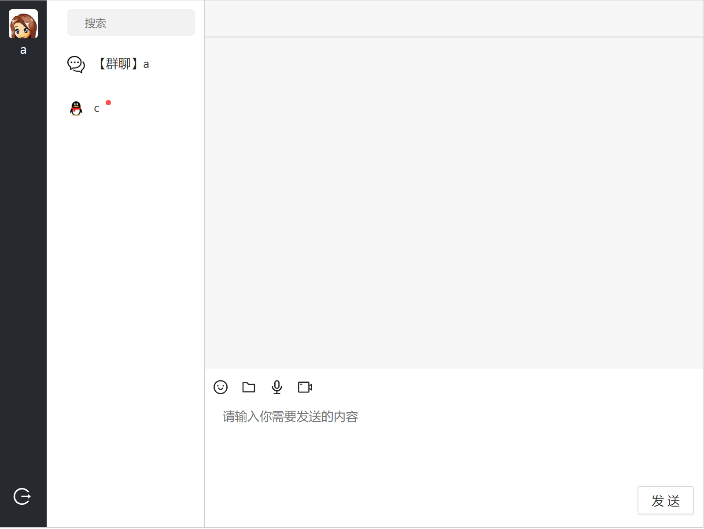
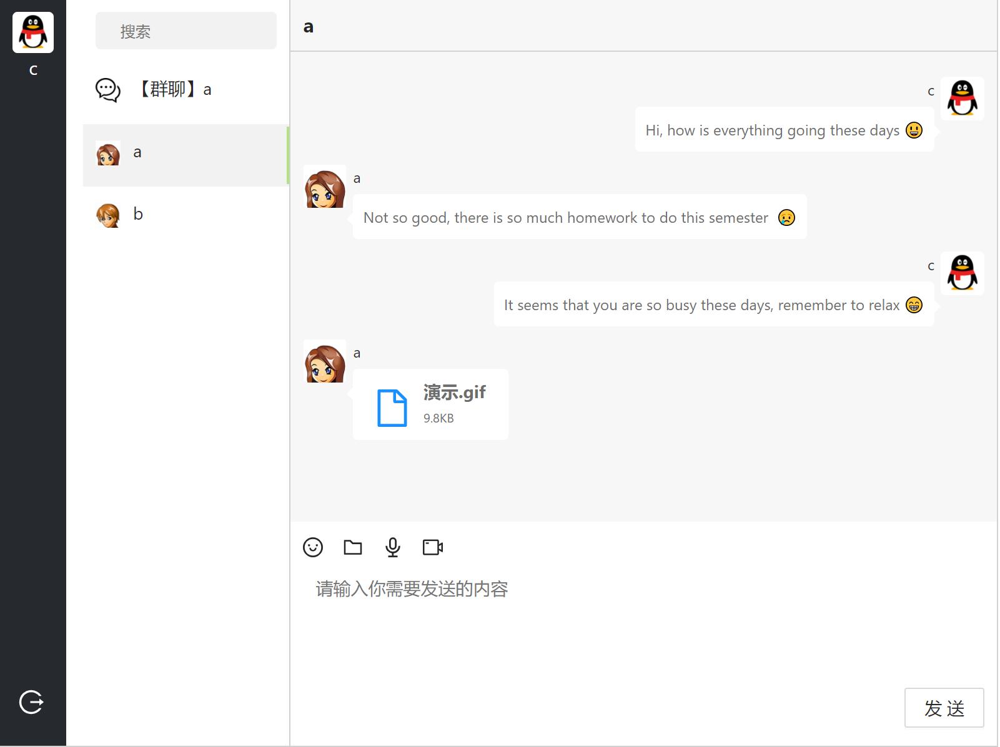
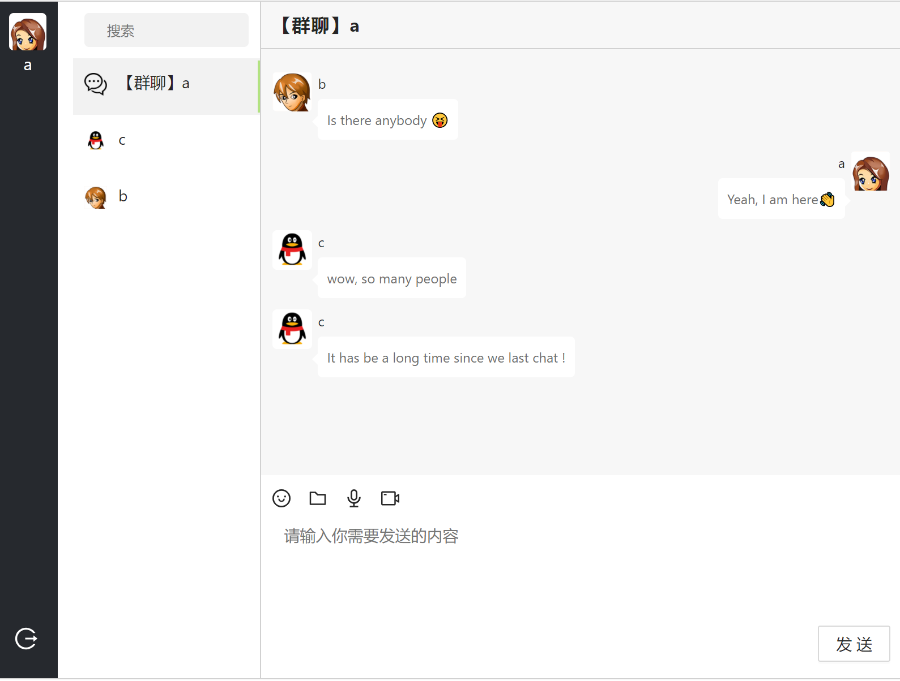
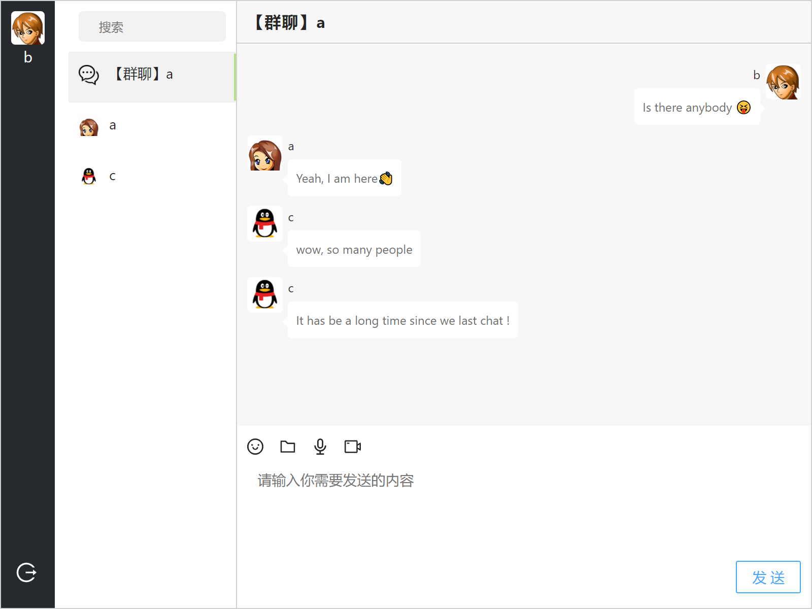
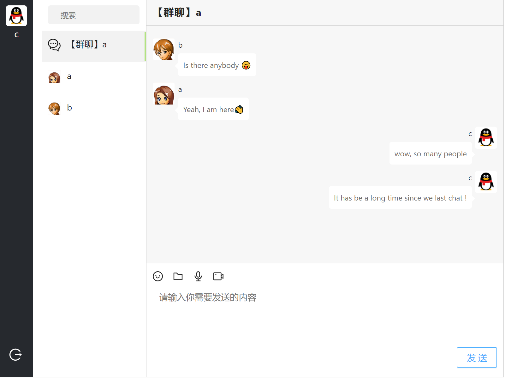
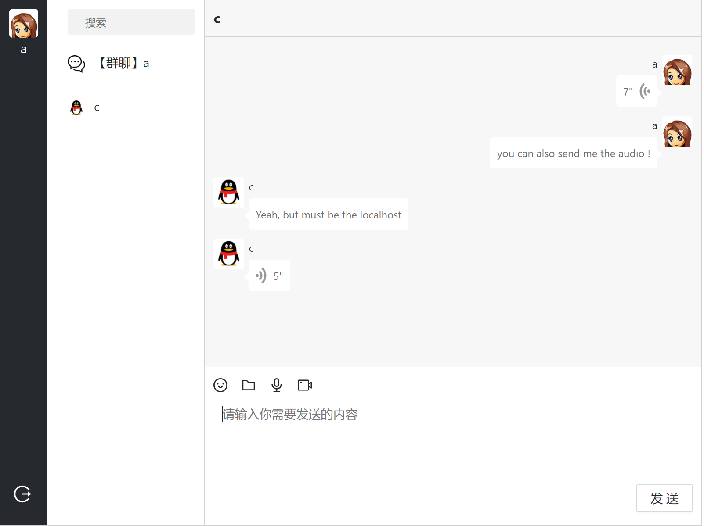
</div>

#### 运行于https环境

> 该环境下支持使用所有功能，视频聊天需要使用多个设备(本地两个网页也可)进行测试，在这里说明局域网配置

1. 进入server目录，执行下面命令

```bash
yarn install
yarn https
```

2. 使用第二个设备连接到本地电脑的`热点`，打开cmd，使用`ipconfig`查看所有ip地址，使用`https://{ip}:3000`访问(<span style="color:red">一定要加https</span>)，选择能够访问到前端的ip地址，假设为ip，打开`.env.development`，设置为`REACT_APP_SOCKET_URL=https://{ip}:3001`，使用上面`一样的命令`运行客户端

3. 在第二台设备中打开网页`https://{ip}:3000`(之前界面不要关闭，因为自己签发的https证书不受信任，关闭之后可能不能连接到服务端)，然后登录进去；本地亦是如此

   进入客户端或者服务端界面的时候都有可能出现下面的情况，请选择`advanced`中的`continue`

   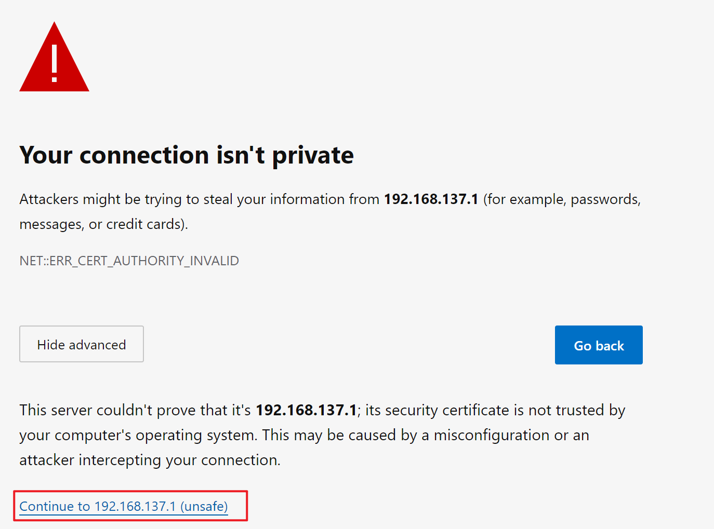

4. 建议在本地端发送数据给第二台设备(视频不太稳定)

<div style="width:100%;display:flex;flex-flow:row wrap; align-content:space-between; padding:10px"}>
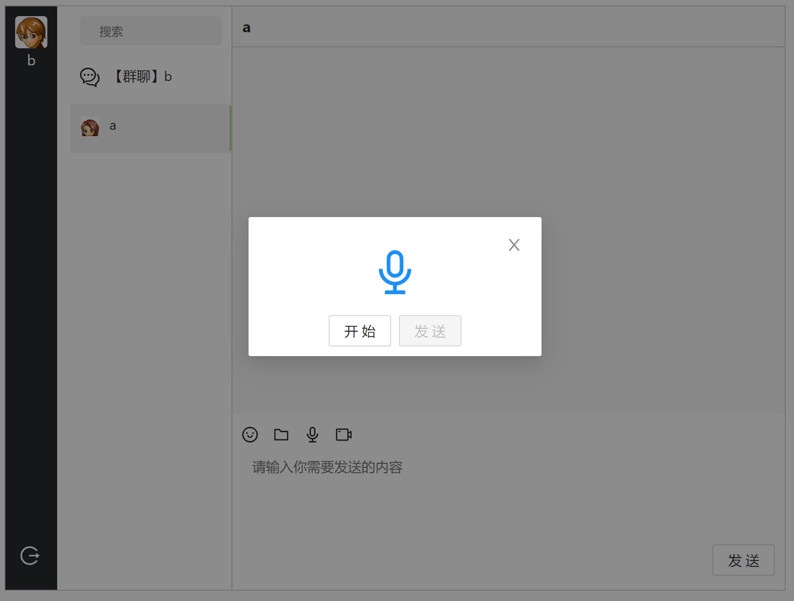
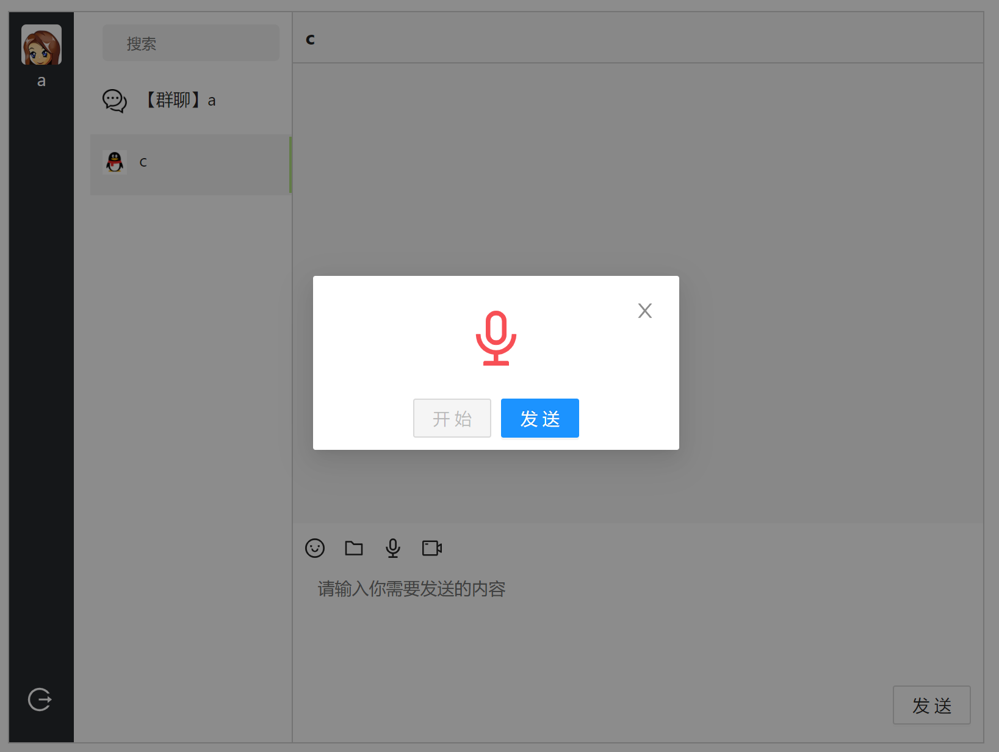
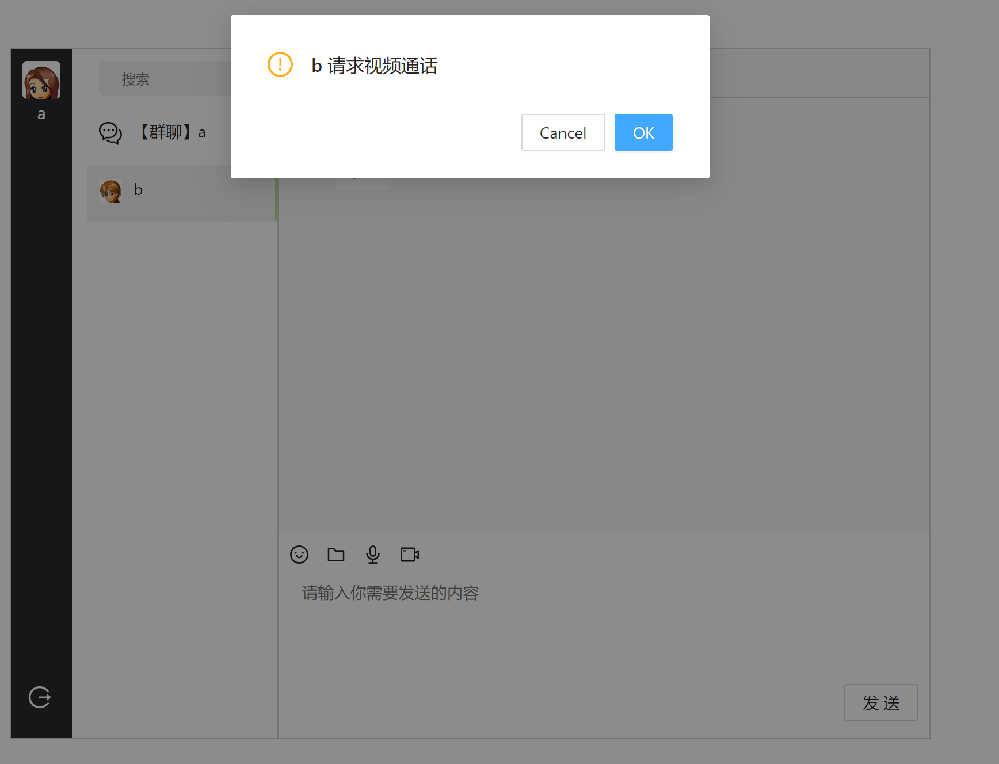
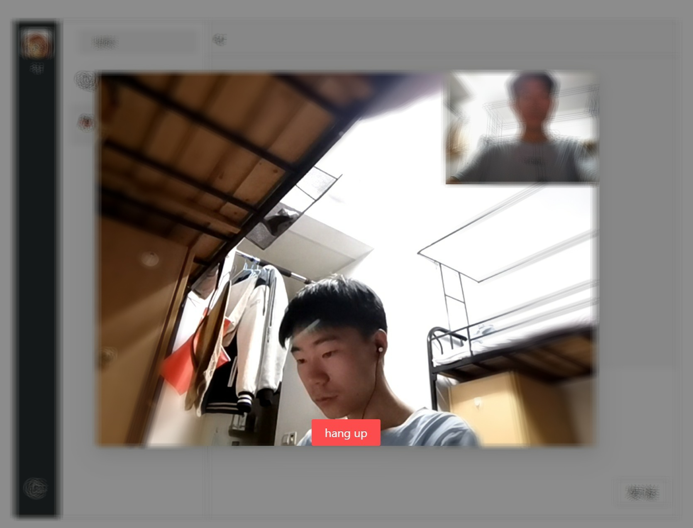
</div>
### 演示效果

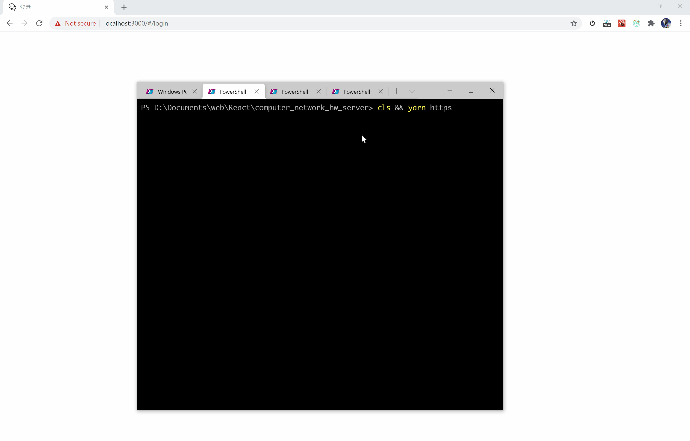


## 简单讲解：

作为一个聊天程序，用户之间需要进行聊天，一个是写死对方的地址，然后直接发送消息，另一个就是通过第三方进行消息的中转，我们只需要知道服务端的地址即可，当然，我们也可以通过服务端知道了对方的地址，然后直接进行通信，本项目采用的是`服务端中转`

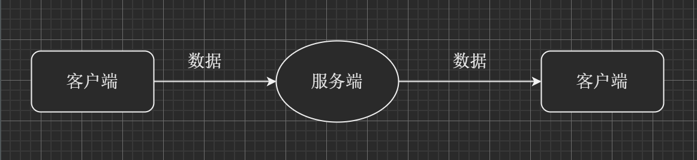


文本，文件，语音只不过发送的数据类型不同罢了，`socket.io`支持二进制文件的发送，那么由它转发即可，不过注意设置好缓冲大小，否则容易断开连接

音视频通话使用`WebRTC`[^4]，用户A先请求用户B可否进行通话，如果可以，然后在使用`RTCPeerConnection`进行连接，将`stream`加到对应的`video`元素上即可，实际上本项目采用的有两次下面的过程，一次是为了确认用户是否同意，另一次才是实际连接的建立

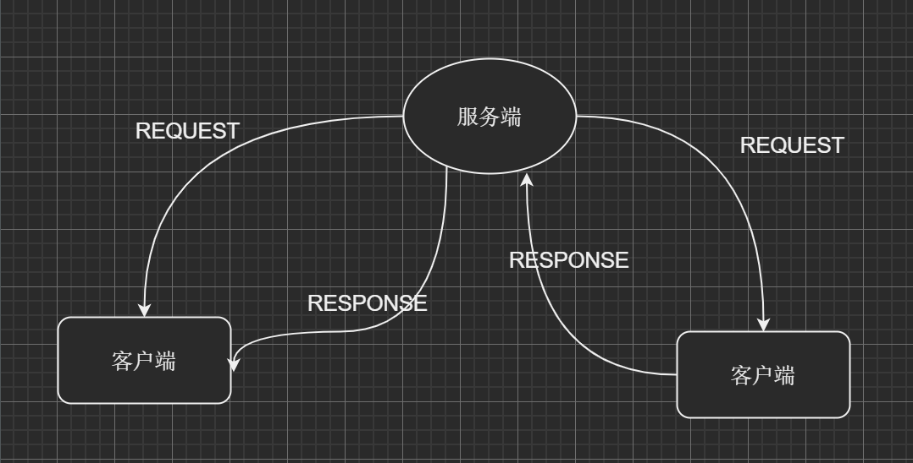

### docker 运行
在client 目录下
```bash
docker build -t=chat-client .
docker run -p 3000:3000 --name client chat-client
```

在server 目录下
```bash
docker build -t=chat-server .
docker run -p 3001:3001 --name server chat-server
```
创建成功之后，可在本地进行预览

### 局限

- 本项目数据不进行持久性保存，实时聊天通话，所有消息仅保存在内存中，当然可以实现持久化保存，但目前本项目暂不实现
- 功能较少，用户配置无
- 视频聊天的时候存在一定的回声
- ...


[^1]:https://github.com/sjtu-course/ppt/tree/main/day2-2/src_code/chat-demo
[^2]:https://reactjs.org/
[^3]:https://ant-design.gitee.io/components/overview/
[^4]: https://github.com/webrtc
